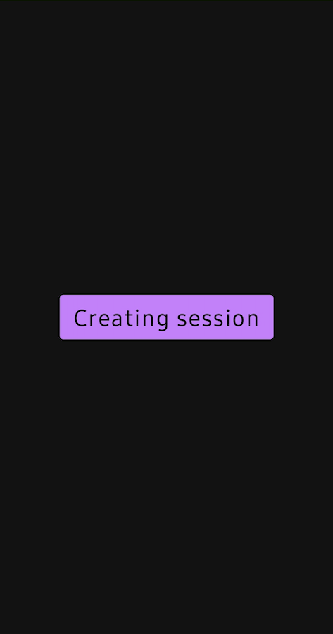
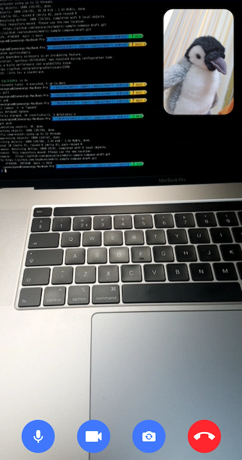

<h1 align="center">WebRTC in Jetpack Compose</h1></br>

<p align="center">
  <a href="https://opensource.org/licenses/Apache-2.0"></a>
  <a href="https://android-arsenal.com/api?level=23"></a>
  <a href="https://github.com/GetStream/webrtc-in-jetpack-compose/actions/workflows/android.yml"></a>
  <a href="https://androidweekly.net/issues/issue-553"></a>
  <a href="https://getstream.io?utm_source=Github&utm_medium=Github_Repo_Content_Ad&utm_content=Developer&utm_campaign=Github_Aug2023_Jaewoong_MeetingRoomCompose&utm_term=DevRelOss"></a>
</p>


This project demonstrates [WebRTC protocol](https://getstream.io/glossary/webrtc-protocol/) to facilitate real-time video communications with Jetpack Compose.

The purpose of this repository is to demonstrate below:
- Implementing entire UI elements for real-time video communication with Jetpack Compose.
- Performing real-time communication in background with Kotlin Coroutines.
- Understanding the peer connection based on WebRTC.
- Communicating with a signaling server to exchange peer connection information between clients.

## ✍️ Technical Content

If you want to have a better grasp of how WebRTC works, such as basic concepts of WebRTC, relevant terminologies, and how to establish a peer-to-peer connection and communicate with the signaling server in Android, check out the articles below:

- **[Building a Video Chat App: WebRTC on Android (Part1)](https://getstream.io/blog/webrtc-on-android?utm_source=Github&utm_medium=Github_Repo_Content_Ad&utm_content=Developer&utm_campaign=Github_Aug2023_Jaewoong_MeetingRoomCompose&utm_term=DevRelOss)**
- **[Building a Video Chat App: WebRTC in Jetpack Compose (Part2)](https://getstream.io/blog/webrtc-jetpack-compose?utm_source=Github&utm_medium=Github_Repo_Content_Ad&utm_content=Developer&utm_campaign=Github_Aug2023_Jaewoong_MeetingRoomCompose&utm_term=DevRelOss)**
- **[HTTP, WebSocket, gRPC or WebRTC: Which Communication Protocol is Best For Your App?](https://getstream.io/blog/communication-protocols?utm_source=Github&utm_medium=Github_Repo_Content_Ad&utm_content=Developer&utm_campaign=Github_Aug2023_Jaewoong_MeetingRoomCompose&utm_term=DevRelOss)**

If you'd like to get notified as we release future posts, join the **[watchers](https://github.com/GetStream/webrtc-in-jetpack-compose/watchers)** on GitHub or follow **[Stream](https://twitter.com/getstream_io)** on Twitter. You can also follow the __[author](https://github.com/skydoves)__ of this repository on GitHub.

<a href="https://getstream.io/chat/sdk/compose">

</a>

## 🛥 Stream Chat and Voice & Video calling SDK
If you’re interested in adding powerful In-App Messaging to your app, check out the __[Compose Chat SDK for Messaging](https://getstream.io/chat/sdk/compose?utm_source=Github&utm_medium=Github_Repo_Content_Ad&utm_content=Developer&utm_campaign=Github_Aug2023_Jaewoong_MeetingRoomCompose&utm_term=DevRelOss)__! We're also planning to release voice & video calling SDK very soon! Check out the **[Video & Voice Calling API on Stream's Global Edge Network](https://getstream.io/video?utm_source=Github&utm_medium=Github_Repo_Content_Ad&utm_content=Developer&utm_campaign=Github_Aug2023_Jaewoong_MeetingRoomCompose&utm_term=DevRelOss)**, if you want early access to our SDK.

- [Stream Video SDK for Android on GitHub](https://github.com/getStream/stream-video-android)
- [Video Call Tutorial](https://getstream.io/video/docs/android/tutorials/video-calling?utm_source=Github&utm_medium=Github_Repo_Content_Ad&utm_content=Developer&utm_campaign=Github_Aug2023_Jaewoong_MeetingRoomCompose&utm_term=DevRelOss)
- [Audio Rooom Tutorial](https://getstream.io/video/docs/android/tutorials/audio-room?utm_source=Github&utm_medium=Github_Repo_Content_Ad&utm_content=Developer&utm_campaign=Github_Aug2023_Jaewoong_MeetingRoomCompose&utm_term=DevRelOss)
- [Livestream Tutorial](https://getstream.io/video/docs/android/tutorials/livestream?utm_source=Github&utm_medium=Github_Repo_Content_Ad&utm_content=Developer&utm_campaign=Github_Aug2023_Jaewoong_MeetingRoomCompose&utm_term=DevRelOss)

## 📲 Download APK
Go to the [Releases](https://github.com/GetStream/webrtc-in-jetpack-compose/releases) to download the latest APK.

## 📷 Previews

<p align="center">


</p>

## 🛠 Tech Stacks & Open Source Libraries
- Minimum SDK level 23.
- 100% [Jetpack Compose](https://developer.android.com/jetpack/compose) based + [Coroutines](https://github.com/Kotlin/kotlinx.coroutines) + [Flow](https://kotlin.github.io/kotlinx.coroutines/kotlinx-coroutines-core/kotlinx.coroutines.flow/) for asynchronous.
- [WebRTC](https://webrtc.org/): To build real-time communication capabilities to your application that works on top of an open standard.
- [Stream WebRTC Android](https://github.com/GetStream/stream-webrtc-android): A WebRTC pre-compiled library for Android reflects the recent WebRTC updates and supports functional UI components and extensions for Android and Jetpack Compose.
- [Retrofit2 & OkHttp3](https://github.com/square/retrofit): Construct the REST APIs and paging network data.
- [StreamLog](https://github.com/GetStream/stream-log): A lightweight and extensible logger library for Kotlin and Android.
- [Ktor](https://github.com/ktorio/ktor): Building a signaling client websocket server.

## 💻 How to build the project?

To build this project properly, you should follow the instructions below:

1. Run the [WebRTC backend server](https://github.com/GetStream/webrtc-in-jetpack-compose/tree/main/webrtc-backend).
2. Add the local ip address of your pc on the `local.properties` file on the project (Android Studio) like the below:

```
# You should change 192.168.1.123 to your local ip address, which is running the WebRTC backend server.
SIGNALING_SERVER_IP_ADDRESS=ws://192.168.1.123:8080/rtc
```

You will get your local IP address by typing the command below on your terminal:

```
ifconfig | grep "inet " | grep -Fv 127.0.0.1 | awk '{print $2}' 
```

3. Lastly, run the [WebRTC android](https://github.com/GetStream/webrtc-in-jetpack-compose/tree/main/webrtc-android) project on your multiple devices to test peer communication.

## 🤝 Contribution

Most features are not completed except the chat feature, so that anyone can contribute and improve this project following the [Contributing Guideline](https://github.com/GetStream/webrtc-in-jetpack-compose/blob/main/CONTRIBUTING.md).

## Find this repository useful? 💙
Support it by joining __[stargazers](https://github.com/GetStream/webrtc-in-jetpack-compose/stargazers)__ for this repository. :star: <br>
Also, follow __[maintainers](https://github.com/skydoves)__ on GitHub for our next creations! 🤩

# License
```xml
Copyright 2023 Stream.IO, Inc. All Rights Reserved.

Licensed under the Apache License, Version 2.0 (the "License");
you may not use this file except in compliance with the License.
You may obtain a copy of the License at

   http://www.apache.org/licenses/LICENSE-2.0

Unless required by applicable law or agreed to in writing, software
distributed under the License is distributed on an "AS IS" BASIS,
WITHOUT WARRANTIES OR CONDITIONS OF ANY KIND, either express or implied.
See the License for the specific language governing permissions and
limitations under the License.
```
